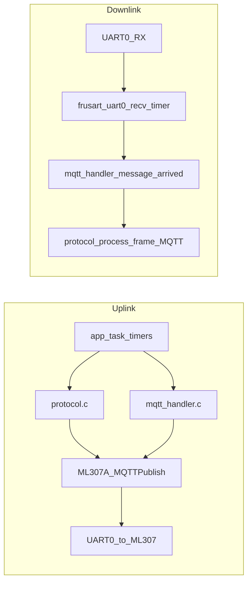

# MQTT 服务模块功能规格文档

本文档描述 `ble_simple_peripheral` 工程中 MQTT 相关实现的行为、接口与约束，路径均相对于本文件所在目录（`docs/`）。

## 1. 范围与架构定位

本仓库中 **MQTT 并非独立 TCP 协议栈**，而是由 **ML307 4G 模组通过 UART0 AT 指令** 承载：主控（Cortex-M3）负责配置、连接状态机、发布载荷透传与下行 URC 解析。应用侧统一二进制协议与 BLE/UART1 共用。

**主要源文件（规格锚点）：**

| 职责 | 文件 |
|------|------|
| 应用层 MQTT API、入站帧解析 | `../usercode/mqtt_handler.c`、`../usercode/mqtt_handler.h` |
| AT 连接状态机、发布、重连、Keepalive 配置 | `../usercode/frATcode.c`、`../usercode/frATcode.h` |
| UART0 接收、`+MQTTrecv` / `+MQTTclosed` 处理 | `../usercode/frusart.c` |
| 统一协议、MQTT 配置命令、经 MQTT 发布响应 | `../usercode/protocol.c`、`../usercode/protocol.h` |
| MQTT 参数 Flash 持久化 | `../usercode/device_config.c`、`../usercode/device_config.h` |
| 周期上报、重连策略、应用事件 | `../usercode/app_task.c`、`../usercode/app_task.h` |
| 启动顺序（BLE 后加载 MQTT） | `../code/proj_main.c` |

---

## 2. 核心职责

1. **连接生命周期**：在蜂窝网络已注册（`AT+CEREG?` 期望 `+CEREG:0,1`）前提下，断开旧会话、配置模组 MQTT 参数、建立 `AT+MQTTCONN`、订阅配置中的下行主题。
2. **发布**：将应用层协议帧作为 **二进制载荷**，经 `AT+MQTTPUB=0,"<topic>",<len>` 触发后，在收到 `>` 提示后 **逐字节 UART 透传** 载荷。
3. **订阅下行**：解析 `+MQTTrecv:` URC，提取长度与 `\r\n` 后数据区，交给 `mqtt_handler_message_arrived` 做协议解析与业务分发。
4. **配置管理**：`g_mqtt_config` 运行时结构；可通过协议命令 `CMD_SET_MQTT_CONFIG` / `CMD_GET_MQTT_CONFIG` 读写；成功写入后 **落 Flash** 并触发重连流程。
5. **与业务数据联动**：周期任务在 MQTT 已连接时上报功率、温度；心跳与状态帧同时可走 BLE 与 MQTT。

---

## 3. 关键特性

- **单一真实连接状态源**：`R_atcommand.MLinitflag == ML307AMQTT_OK` 表示已连接并完成订阅；`mqtt_handler.c` 内 `mqtt_is_connected()` 直接读取该标志，避免与应用层缓存不一致。
- **非阻塞连接推进（当前产品路径）**：`proj_main.c` 中 `user_entry_after_ble_init` 在 BLE 就绪后调用 `app_task_init_mqtt_timers()`，再 `app_task_start_reconnect_timer()`；定时器每次回调 **仅调用一次** `ML307A_MQTTinit()`，推进状态机一步，避免阻塞 BLE 回调路径。
- **协议统一**：MQTT 负载与 UART1、BLE GATT 使用相同 `protocol_parse_frame` / `protocol_process_frame(..., source=1)`。
- **默认发布主题集中**：业务发送经 `protocol_send_buffer(..., SOURCE_MQTT)` 时固定使用 `g_mqtt_config.publish_topic`（与 `mqtt_handler_publish` 可指定任意 topic 的路径并存）。

---

## 4. 支持的操作（API / 行为）

| 操作 | 入口 | 说明 |
|------|------|------|
| 初始化处理器 | `mqtt_handler_init()` | 清空可选数据回调 |
| 连接状态 | `R_atcommand.MLinitflag`、`mqtt_is_connected()`（static） | 应用层通过全局 AT 状态判断 |
| 发布（通用） | `mqtt_handler_publish(topic, data, len)` | 校验连接后调用 `ML307A_MQTTPublish` |
| 订阅 / 退订 | `mqtt_handler_subscribe` / `mqtt_handler_unsubscribe` | `AT+MQTTSUB` / `AT+MQTTUNSUB`，等待 `OK`，超时 5s |
| 注册原始载荷回调 | `mqtt_handler_register_callback` | 在协议解析之后调用 |
| 上报遥测 | `mqtt_handler_send_power/temperature/status` | 内部 `protocol_send_* (1)` |
| 连接状态机单步 | `ML307A_MQTTinit()` | 每次调用根据 `R_atcommand.ML307Con` 执行 **一个** 分支 |
| 阻塞式完整初始化（代码存在） | `MLHardwareINIT()` | 含 GPIO/上电/复位/`ML307A_Init` 与 while 循环直至连接或超时；**默认不在 `user_entry_after_ble_init` 中调用**（见第 11 节） |
| 阻塞式重连 | `ML307A_MQTTReconnect()` | 重置状态后循环调用 `ML307A_MQTTinit`；成功则 `app_task_stop_reconnect_timer()` |

**应用事件（`app_task.h`）：**

- `APP_EVT_MQTT_CONNECTED`：连接成功；`app_task_func` 中发送设备信息与状态。
- `APP_EVT_MQTT_DISCONNECTED`：启动重连定时器。
- `APP_EVT_MQTT_CONFIG_UPDATED`：断开、清 `mqtt_recv`、将状态机置于 `DIS_CONNECTING` 并重启短延迟重连。
- `APP_EVT_MQTT_DATA_RECEIVED`：**已定义**，但代码库中 **未发现** `app_task_send_event` 投递；下行数据在 `mqtt_handler_message_arrived` 内同步处理。

---

## 5. 与其他组件的集成点

- **BLE**：并行通道；传感器 MQTT 上报不依赖 BLE 连接（`sensor_read_timer_func`）。
- **协议层**：`CMD_SET_MQTT_CONFIG` / `CMD_GET_MQTT_CONFIG`（`protocol.h`）；设置成功调用 `mqtt_config_save` 并 `app_task_send_event(APP_EVT_MQTT_CONFIG_UPDATED)`。
- **Flash**：`mqtt_config_storage_t` 魔数 `MQTT_CONFIG_MAGIC`，扇区地址 `MQTT_CONFIG_FLASH_ADDR`（4096×2）。
- **ML307A_ProcessURC**：`frATcode.c` 中依赖 `R_atcommand.mqtt_recv.urc_ready`；**当前仓库未检索到将该标志置 true 的写入**，实际 URC 处理以 **frusart 内联解析** 为主；`+MQTTclosed` 在 frusart 与 URC 处理函数中存在 **重复逻辑风险**（维护时需保持一致）。

---

## 6. 配置参数

### 6.1 运行时结构 `mqtt_config_t`（`frATcode.h`）

- `server_addr[128]`、`server_port[6]`、`client_id[128]`、`username[128]`、`password[128]`
- `subscribe_topic[128]`、`publish_topic[128]`

编译期默认值见 `g_mqtt_config`（`frATcode.c`，占位字符串）；Flash 有效则 `mqtt_config_load`（`device_config.c`）覆盖。

### 6.2 模组侧 MQTT 与 AT 超时（`frATcode.h` / `frATcode.c`）

- `PING_REQ_TIME` **60**（`AT+MQTTCFG="pingreq",0,60`）
- `KEEP_ALIVE_TIME` **125**（`AT+MQTTCFG="keepalive",0,125`）
- `AT+MQTTCFG="pingresp",0,1`
- `ML307_AT_TIMEOUT` **3000 ms**（多数 AT 等待）
- 发布：等待 `>` **2000 ms**，随后等待 `OK` **5000 ms**

### 6.3 应用层重连策略（`app_task.c`）

- `MQTT_RECONNECT_INTERVAL_MS` = 30000
- `MQTT_RECONNECT_MAX_RETRY` = 10，达到后间隔延长至 **120000 ms**
- `app_task_start_reconnect_timer` 首次 **1000 ms** 后触发

### 6.4 协议帧约束（`protocol.h`）

- `MAX_DATA_LENGTH` = 252（`data_length` 为 uint8，须满足 `3 + N ≤ 255`），单帧 MQTT 应用载荷受协议层限制。

---

## 7. 主题与 QoS

- **订阅（连接流程内）**：`AT+MQTTSUB=0,"<subscribe_topic>",1` —— 第三个参数固定为 **QoS 1**（`ML307A_MQTTinit`、`mqtt_handler_subscribe`）。
- **发布**：`AT+MQTTPUB=0,"<topic>",<len>` —— **源码未传入 QoS / retain 参数**，行为以 **ML307 AT 手册默认值** 为准（应用层不可切换 QoS，除非扩展 AT 格式）。
- **业务默认发布主题**：统一为 `g_mqtt_config.publish_topic`；`mqtt_handler_publish` 可指定其他 topic，但协议封装的上报函数走默认发布主题。

---

## 8. 消息流处理过程

### 8.1 出站（协议帧 → MQTT）

1. 业务调用 `protocol_send_*` 或 `mqtt_handler_send_*`，`source = 1`（`SOURCE_MQTT`）。
2. `protocol_send_buffer` 检查 `ML307AMQTT_OK`，调用 `ML307A_MQTTPublish(publish_topic, buffer, len)`。
3. `ML307A_MQTTPublish` 发 AT，收到 `>` 后 `uart_putc_noint_no_wait` 逐字节写 UART0，再等待 `OK`。

### 8.2 入站（MQTT → 协议）

1. UART0 收满一帧后 `uart0_recv_timer_func`（`frusart.c`）检测 `+MQTTrecv:`。
2. 解析期望长度与 `\r\n` 后二进制区；调用 `mqtt_handler_message_arrived(g_mqtt_config.subscribe_topic, payload, min(actual, expected))`。
3. `mqtt_handler_message_arrived`：`protocol_parse_frame` → 成功则 `protocol_process_frame(&frame, 1)`；再调用可选 `data_callback`。

**注意**：传入 `mqtt_handler_message_arrived` 的 topic 参数 **固定为配置的 subscribe_topic 字符串**，并非从 URC 中解析出的 topic；多主题或别名场景下日志与回调语义可能与真实 topic 不一致。

---

## 9. 错误处理与状态

| 场景 | 行为 |
|------|------|
| AT 步骤失败 | 打印 `NET_REG_FAIL` / `MQTT_DISC_FAIL` / `MQTT_CONN_FAIL` / `MQTT_SUB_FAIL`；状态机不前进，等待下次 `ML307A_MQTTinit` 调用 |
| `ML307Con == ML_ERROR` | 打印 `MQTT_STATE_ERROR`，`ML307Con` 回到 `NET_INITIALIZING`，`MLinitflag` → `ML307A_Idle` |
| 发布失败 | `MQTT Publish failed`；`protocol_send_buffer` 打 `ERR: MQTT publish failed` |
| 服务端断开 `+MQTTclosed:` | `MLinitflag` → `ML307A_Idle`，`APP_EVT_MQTT_DISCONNECTED`，应用层启动重连定时器 |
| 配置更新 | 已连则 `AT+MQTTDISC=0`，再重置状态机并短延迟重连 |

`mqtt_handler_connection_callback` 当前 **仅日志**，不修改连接标志。

---

## 10. 限制与约束条件

1. **依赖蜂窝注册**：状态机首步要求 `+CEREG:0,1`；无网络时无法前进。
2. **单链路 ID**：AT 中 `linkid` 固定 **0**。
3. **单发布主题惯例**：协议层群发使用 `publish_topic`；多主题需自行调用 `mqtt_handler_publish`。
4. **QoS / Retain 不可配**：订阅 QoS 固定 1；发布 QoS 由模组 AT 默认决定。
5. **载荷长度**：受协议 `MAX_DATA_LENGTH` 与模组 `AT+MQTTPUB` 最大长度双重约束（后者需查 ML307 文档）。
6. **阻塞式 AT 等待**：`ML307A_MQTTinit` 与 `ML307A_MQTTPublish` 内部 `AT_WaitResponse` 在调用线程上阻塞；产品路径通过定时器 **每次单步** 降低单次阻塞时间，但整体仍受 AT 超时影响。
7. **`MLHardwareINIT` / `ML307A_Init`**：提供完整上电与握手及阻塞式 MQTT 连接循环；**与 `proj_main` 当前“BLE 后非阻塞 MQTT”策略冲突**，故默认不在 `user_entry_after_ble_init` 中调用；详见第 11 节。
8. **`APP_EVT_MQTT_DATA_RECEIVED` 未使用**：若需异步投递到应用任务，需补充 `app_task_send_event`。
9. **`ML307A_ProcessURC` 与 `mqtt_recv.urc_ready`**：若无其他模块置位，该路径不会执行；维护时避免误以为已启用。

---

## 11. 硬件初始化与 UART0 集成评估（实施结论）

### 11.1 UART0 前置条件

AT 命令与 MQTT 发布均经 `USART_0_listADD` / UART0 驱动。**必须在启动 MQTT 定时器与状态机之前调用 `fruart0_init()`**（配置 PA0/PA7、波特率、RX 中断）。本工程已在 `proj_main.c` 的 `user_entry_after_ble_init` 中，于 `fros_uarttmr_INIT()` **之前** 增加 `fruart0_init()`，保证 ML307 与 `uart0_recv_timer` / `uart0_send_timer` 协同工作时硬件已就绪。

### 11.2 `MLHardwareINIT` 是否接入启动流程

| 方案 | 优点 | 缺点 |
|------|------|------|
| 在 `user_entry_after_ble_init` 调用 `MLHardwareINIT` | 冷启动一次完成模组上电、GPIO、`ML307A_Init`、首连 MQTT | 内含 **长时间 while 循环**，在 BLE 栈触发该回调的路径上 **易阻塞栈线程**，与现有注释“非阻塞 MQTT”矛盾 |
| 保持现状 + 定时器单步 `ML307A_MQTTinit` | 与产品设计一致，单次阻塞时间短 | **不**执行 `MLHardwareINIT` 内的 GPIO/上电/复位/`ML307A_Init`；若硬件侧依赖这些步骤，冷启动可能无法建链 |
| 后续改进 | 将上电/GPIO/`ML307A_Init` 拆成非阻塞状态机，或放到独立 OS 任务 | 需额外设计与测试 |

**当前结论**：不在 `user_entry_after_ble_init` 中调用 `MLHardwareINIT`。若现场必须模组硬复位与完整 AT 握手，应在独立任务或非阻塞拆分后接入，或由硬件/电源策略保证模组在应用跑 MQTT 状态机前已上电并就绪；并请以 ML307 数据手册核对 `AT+MQTTCONN` 前置条件。

---

## 12. 文档维护

- 修订固件时同步核对：`g_mqtt_config` 默认值、ML307 AT 指令集版本、`MAX_DATA_LENGTH`。
- 本文档路径：`docs/MQTT模块功能规格.md`。
