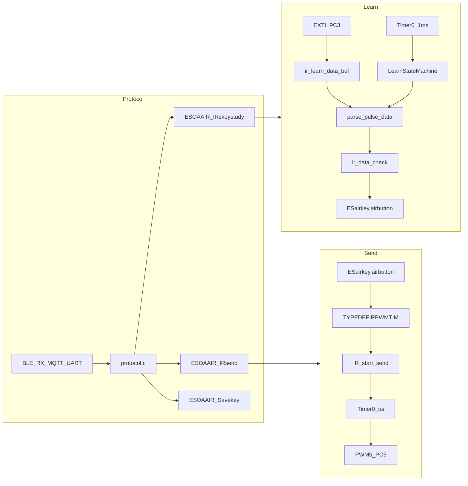

# 红外控制模块说明（代码阅读整理）

基于当前仓库中 **ESOACV2/ble_simple_peripheral** 工程，整理红外学习与发送的软件架构、硬件引脚、数据结构与协议命令的对应关系。本文档仅描述现有实现，不涉及代码修改。

---

## 1. 模块范围与主文件

| 职责 | 文件 |
|------|------|
| 编解码、学习/发送状态机、底层驱动与中断 | `usercode/frIRConversion.c`、`usercode/frIRConversion.h` |
| 学习结果写入/读出 SPI Flash | `usercode/IRLearntr.c`（`ESOAAIR_Savekey` / `ESOAAIR_readkey`） |
| BLE/MQTT/UART 协议中的红外命令与空调控制发码 | `usercode/protocol.c`、`usercode/protocol.h` |
| 全局空调状态与类型（间接依赖红外头文件） | `usercode/aircondata.h` |

SDK 下另有示例 `SDK/FR801xH-SDK/examples/none_evm/air_conditioner_controller/code/ir_control.c` 与 `vscode/` 内若干实验性文件。**当前 Keil 工程实际编译的是 `usercode/frIRConversion.c`**（工程文件 `keil/ble_simple_peripheral.uvprojx` 仅包含该路径）。

---

## 2. 硬件与定时资源（实现结论）

- **发送**：`Timer0` 按微秒级间隔切换 **PWM5（PC5）** 的载波开/关；载波频率来自 `TYPEDEFIRPWMTIM.ir_carrier_fre`（默认宏 `IR_CARRIER_FRE` = 38kHz，学习结果会覆盖为估算的 36k/38k/56k）。
- **学习**：**PC3** 映射 **EXTI_3**，下降沿触发；与 `Timer0`（学习模式下约 **1ms** 周期）配合，在 `exti_isr_ram` 中记录边沿间隔，在 `timer0_isr_ram` 中跑学习状态机。

---

## 3. 发送路径

### 3.1 “协议波形”编码发送（未在业务主路径使用）

- `IR_decode()`：把字节流按 **引导码 + 8 位低位在前 + 停止位** 展开为高低电平持续时间数组，时间常量见头文件中 `IRLEADLOW/HIGHT`、`IRLOGIC0*`、`IRLOGIC1*`、`IRSTOP*`。
- 头文件注释提到参考 `IR_test_demo0()`；**`IR_test_demo0` 仅在 `frIRConversion.h` 声明，在 `frIRConversion.c` 中无实现**（SDK 的 `components/driver/IR/driver_ir_send.c` 中有同名示例，但当前工程未编入）。

### 3.2 “学习回放”发送（业务实际使用）

- `IR_start_send(TYPEDEFIRPWMTIM *)`：若 **正在学习**（`ir_learn_data.IR_learn_state` bit1）或 **已在发送**（`IR_PWM_TIM.IR_Busy`），则拒绝；否则拷贝参数、置 busy、配置 PWM5 + Timer0，`timer0_isr_ram` 中交替修改 PWM 占空比实现载波调制。
- `ESOAAIR_IRsend(uint8_t keynumber)`：从 `ESairkey.airbutton[keynumber]` 取已学习数据（要求 `IR_learn_state` bit0=1），填 `TYPEDEFIRPWMTIM` 后调用 `IR_start_send`。
- 发送结束：`timer0_isr_ram` 向 `user_ir_task_id` 投递事件；`IR_task_func` 释放 PC5、停 Timer0、清 busy。需调用 **IR_init()** 才会创建该任务。当前源码树中 **无任何 `.c` 文件调用 `IR_init()`**；若最终固件链接阶段将该符号裁掉，则 `user_ir_task_id` 可能保持 `TASK_ID_NONE`，发送完成后的收尾（释放引脚、清 busy 等）依赖 `os_msg_post` 行为，存在实现层面的风险点。

### 3.3 协议层对发送的调用

- `protocol.c` 中 `air_ir_send_key_and_wait()`：调用 `ESOAAIR_IRsend(keynumber)` 并轮询 `IR_PWM_TIM.IR_Busy` 直至超时（如 2s）。
- **按键索引与空调控制**：`CMD_SET_POWER` → key **0**；`CMD_SET_MODE` → **1**；温度加/减 → **2** / **3**；`CMD_SET_WIND` → **4**。与枚举 `studyIRKeypress`（`STIR_OnOff`…`STIR_Windspeed`）顺序一致（0~4）。

---

## 4. 学习路径

### 4.1 状态与缓冲区

- 全局 `ir_learn_data`：`IR_learn_state` — bit0 已学习，bit1 学习中；`ir_learn_Date[]` / `ir_learn_data_cnt` 为可直接用于发送的脉冲序列（微秒级语义由 `parse_pulse_data` 生成）。
- 学习过程使用堆上 `TYPEDEFIRLEARN *ir_learn`：大缓冲区 `ir_learn_data_buf[LERANDATABUFMAX]`（原始边沿间隔），解析后写入 `ir_learn_Date`。

### 4.2 状态机（`timer0_isr_ram`，`ir_mode == IR_LEARN`）

1. **IR_WAIT_STOP**：累计定时器 tick，超过约 **200ms** 无 EXTI 活动则认为信号结束，进入 **IR_LEARN_GET_DATA**。
2. **IR_LEARN_GET_DATA**：有开始后，若 **300ms** 无新边沿且 `ir_learn_start` 为真，则：
   - `calculate_carrier_frequency()` 估算载波；
   - `parse_pulse_data()` 把原始缓冲转为“载波段时长 + 间隙”序列，末尾补停止标记；
   - `ir_data_check()` 校验（停止位约 12ms~100ms 的个数、异常短脉冲、长间隔与重复帧等）；
   - 成功则 `save_learned_data()`：拷贝到 `ir_learn_data`，再 **memcpy** 到 `ESairkey.airbutton[ESairkey.AIPstudyKey]`，置 `keyExistence[i]=1`；失败则回到 `IR_WAIT_STOP`。

### 4.3 启动/停止 API

- `IR_start_learn()`：分配 `ir_learn`、设学习模式、配置 PC3/EXTI、Timer0 1ms、开中断。
- `IR_stop_learn()`：清学习中标志、停定时器与 EXTI、释放 `ir_learn`、可选恢复 sleep（`IR_SLEEP_EN`）。
- `ESOAAIR_IRskeystudy(keynumber)`：置 `EIRlearnStatus`，`IR_start_learn()` 成功后记录 `AIPstudyKey`，并启动 **10s** 单次定时器回调 `IR_stop_learn`（与头文件注释“5 秒”不一致，以代码为准为 **10000ms**）。

### 4.4 协议命令（`protocol.h`）

- `CMD_IR_LEARN_START (0x0301)`：`data[0]` 为按键号；若未在学习中则 `ESOAAIR_IRskeystudy`。
- `CMD_IR_LEARN_STOP (0x0302)`：`IR_stop_learn()`。
- `CMD_IR_SEND (0x0303)`：直接 `ESOAAIR_IRsend(data[0])`。
- `CMD_IR_READ_DATA (0x0305)`：读出指定键的 `IR_learn_state`、载波频率 LE、脉冲个数及部分 `ir_learn_Date`（受缓冲区限制分包逻辑见 `protocol.c`）。
- `CMD_IR_SAVE_KEYS (0x0306)`：`ESOAAIR_Savekey()` 将整个 `ESairkey` 写入 Flash 地址 **W25QADDR2**（`usercode/frspi.h` 定义为 `SD4096 * 5`）。

---

## 5. 关键数据结构（摘自头文件）

- **TYPEDEFIRPWMTIM**：发送 busy、PWM 状态、待发送间隔数 `IR_pwm_Num`、时序数组 `IR_Pwm_State_Date[]`、载波频率、`loop` 循环发送标志。
- **TYPEDEFIRLEARNDATA**：学习状态位、时序数组与计数、载波频率、`IRnumberS`。
- **airconditioner ESairkey**：`airbutton[AIRkeyNumber]`（默认 **12** 键槽）、`keyExistence[]`、`keystudy[]`、`EIRlearnStatus`、`AIPstudyKey`。

---

## 6. 数据流简图

---

## 7. 其它说明

- **process_ir_data()**：在 `frIRConversion.c` 中为空实现。
- **ir_data_to_int()**：在 `frIRConversion.h` 声明，**主工程 `frIRConversion.c` 未实现**；仅在 `vscode/` 优化版等文件中存在实现，不属于当前固件编译单元。
- **休眠**：`IR_SLEEP_EN` 为 0 时，学习/发送路径中的 `system_sleep_disable/enable` 不生效。

---

以上说明对应仓库现有代码与工程配置。`ESOAAIR_Savekey()` / `ESOAAIR_readkey()` 分别将 `ESairkey` 写入与读出 **W25QADDR2**；当前源码中 **未见对 `ESOAAIR_readkey()` 的调用**（与 `IR_init()` 类似，是否被链接裁切取决于工程）。若需在断电后恢复已学习按键，应在启动流程中调用 `ESOAAIR_readkey()`，并与协议命令 `CMD_IR_SAVE_KEYS`（触发 `ESOAAIR_Savekey()`）配合使用。
